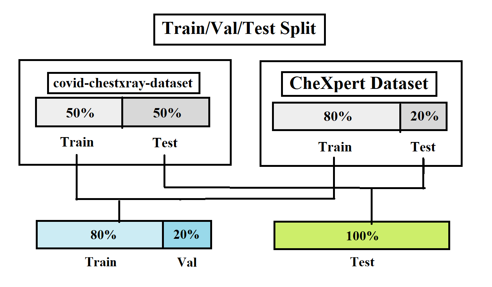
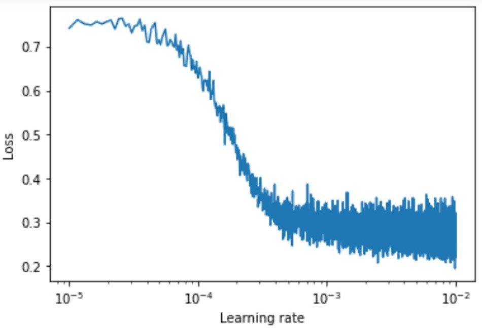

# SARS-CoV-2 Diagnose Tool
Diagnose SARS-CoV-2 from Chest X-Ray Images

# Introduction 

# Data Availablity
Data is so important for Machine Learning based tasks. The data that we feed the deep learning model is currently largest public medical image dataset about COVID-19 which is Joseph Paul Cohen's covid-chestxray-dataset [[0]](https://github.com/Goodsea/SARS-CoV-2-Diagnose-Tool#References). Also we use CheXpert Dataset [[1]](https://github.com/Goodsea/SARS-CoV-2-Diagnose-Tool#References) and concatenate with covid-chestxray-dataset. 

# Installation

- Download the Repository and Get In.
```
$ git clone https://github.com/Goodsea/SARS-CoV-2-Diagnose-Tool.git
$ cd SARS-CoV-2-Diagnose-Tool
```
- Create Anaconda Environment and Install Dependecies
```
$ conda create -n covid19-diagnose-tool python=3.6
$ conda activate covid19-diagnose-tool
$ pip install -r requirements.txt
```
```
# Get access to libraries in conda environment from Jupyter Notebook
$ conda install nb_conda 
```

- Activate the Anaconda Environment 
```
$ conda activate covid19-diagnose-tool
```

- Download and Replace Data
- - Download and Extract CheXpert-v1.0-small from https://stanfordmlgroup.github.io/competitions/chexpert/ to "data" folder (data/CheXpert-v1.0-small) 

- - Download and Extract "covid-chestxray-dataset" via "data/get_covid-chestxray-dataset.sh" 

<b><i> Ready to work with.</i></b>

# Technical Details

## Stratified Train/Val/Test Split and Oversampling
- The dataset has imbalanced classes. So, it may cause overfitting problem. To prevent overfitting problem we use stratification for splitting data. This allows to protect class frequencies while splitting data. 

- Also we apply 10X oversampling to covid-chestxray-dataset's seperated training dataset. 

<i>With this preventions we trying to reduce impacts of class imbalance.</i>
</img>

## Data Augmentation & Normalization
These Data Augmentation Techniques were used:
- HorizontalFlip
- CLAHE
- RandomBrightnessContrast
- ShiftScaleRotate

### Light & Hard Data Augmentation 
We use hard data augmentation to increase variety of oversampled data. Light data augmentation applied to remaining data.
Only difference between Light-Hard data augmentation is probability and limits but used same data augmentation techniques.

## Model
- We used BreastNet model. For More Information: [[2]](https://github.com/Goodsea/SARS-CoV-2-Diagnose-Tool#References)
<p align="center">
  </img>
</p>


## Training Pipeline
- Firstly we train model for 2 epochs to find optimal learning rate. We choose the learning rate according to have most gradient (Not to minimum loss) (2e-4 selected as lr). 

<p align="center">
  </img>
</p>
<br>
- We warm-up model with this decided learning rate for 5 epochs.
</img>
</img>
<br>

- Train the model with SGDR (Stochastic Gradient Descent with Restarts) Learning Rate Schedule for 100 epochs. (Epoch 52: Early Stopped)
</img>
</img>

<br>

- SGDR 
<p align="center">
  </img>
</p>
Image Source: [[3]](https://github.com/Goodsea/SARS-CoV-2-Diagnose-Tool#References)


# Results


<p align="center">
   
</p>

# Contribute
All contributions are welcomed. Please see <a href="CONTRIBUTING.md">CONTRIBUTING.md</a>
# References

[0]  
```
@inproceedings{irvin2019chexpert,
  title={CheXpert: A large chest radiograph dataset with uncertainty labels and expert comparison},
  author={Irvin, Jeremy and Rajpurkar, Pranav and Ko, Michael and Yu, Yifan and Ciurea-Ilcus, Silviana and Chute, Chris and Marklund, Henrik and Haghgoo, Behzad and Ball, Robyn and Shpanskaya, Katie and others},
  booktitle={Thirty-Third AAAI Conference on Artificial Intelligence},
  year={2019}
}
```
[1]
```
@article{cohen2020covid,
  title={COVID-19 image data collection},
  author={Joseph Paul Cohen},
  journal={https://github.com/ieee8023/covid-chestxray-dataset},
  year={2020}
}
```
[2]
```
M. Togaçar, K.B. Özkurt, B. Ergen et al., BreastNet: A novel ˘
convolutional neural network model through histopathological images for the diagnosis of breast
cancer, Physica A (2019), doi: https://doi.org/10.1016/j.physa.2019.123592.
```

[3]
```
https://course.fast.ai/
```


